# Part 1: Còpia seguretat dels equips clients Windows

Per comneçar el primer pas sera tindre una maquina client windows amb un disc principal on tindrem el sistema operatiu i despres un segon disc de 10 Gb en el qual farem la copia.

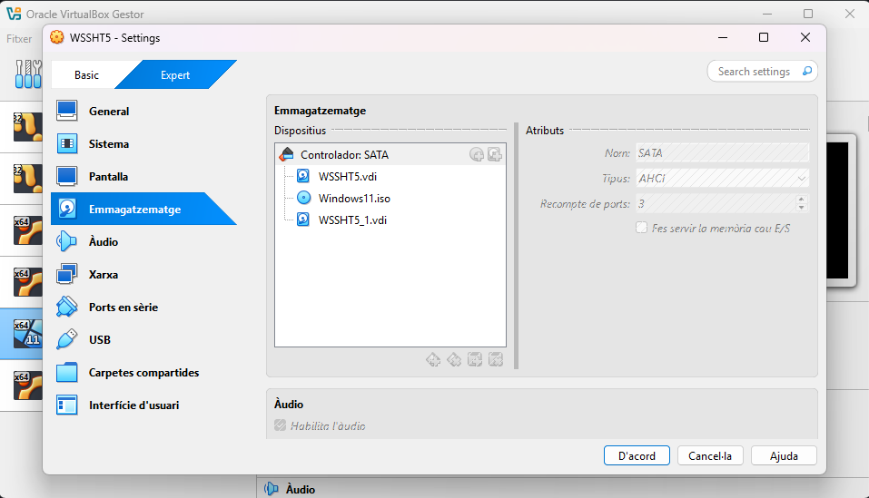

Un cop fet això el seguent pas sera inicialitzar el disc, per fer això el primer pas sera inicar la maquina i obrir l'administrador de disc.

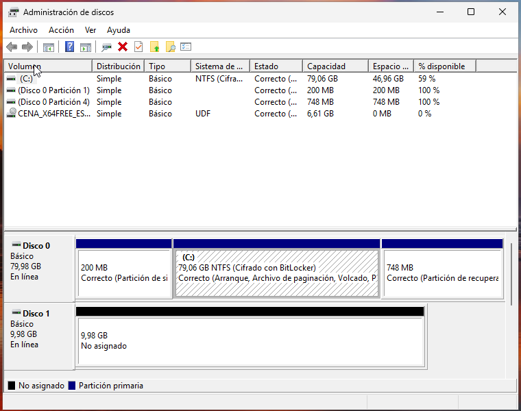

Un cop fet això el que farem sera crear un volum simple en el disc, per fer-ho hem de fer click dret sobre el disc i escollirem la opcio de "Nuevo volumen simple"

Un cop fet això s'obrira una finestra en la qual unicament farem siguiente siguiente fins que tinguem el volum creat i es vegi tal i aixì

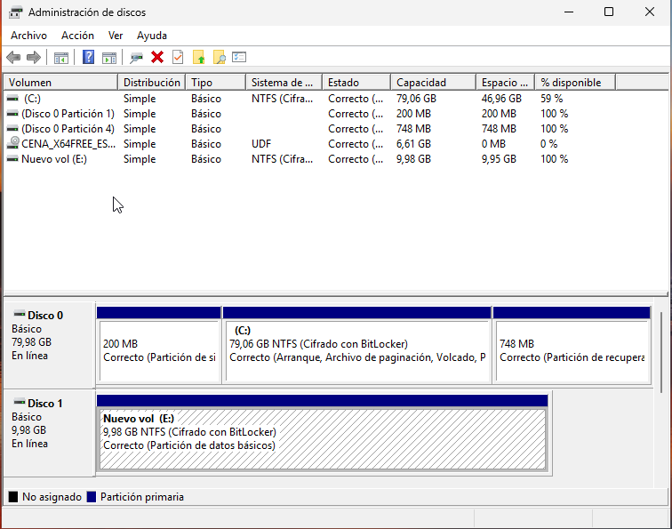

El seguent pas sera instalar duplicati, per fer això anirem al seguent enllaç

[Link de descarrega](https://duplicati.com/download)

Instalarem la versio per el nostre equip, en aquest cas instalarem la versió per windows

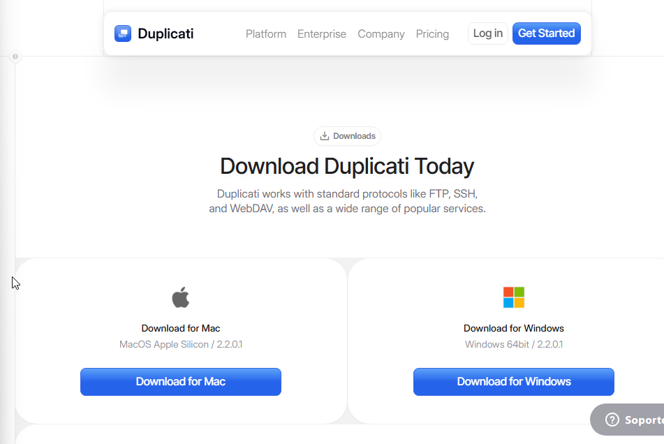

Un cop que tinguem instalat el archiu.exe l'executarem i farem siguiente siguiente, aceptant els termes neccesaris fins que tinguem el duplicati instalat correctament

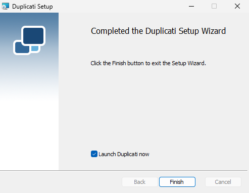

Un cop instalat, s'obrira una pestanya en el nostre navegador en el qual ens demanara que escollim una constrasenya per fer servir duplicati.

En la qual podem escollir qualsevol contrasenya ja que sera personal, important no olvidar-la

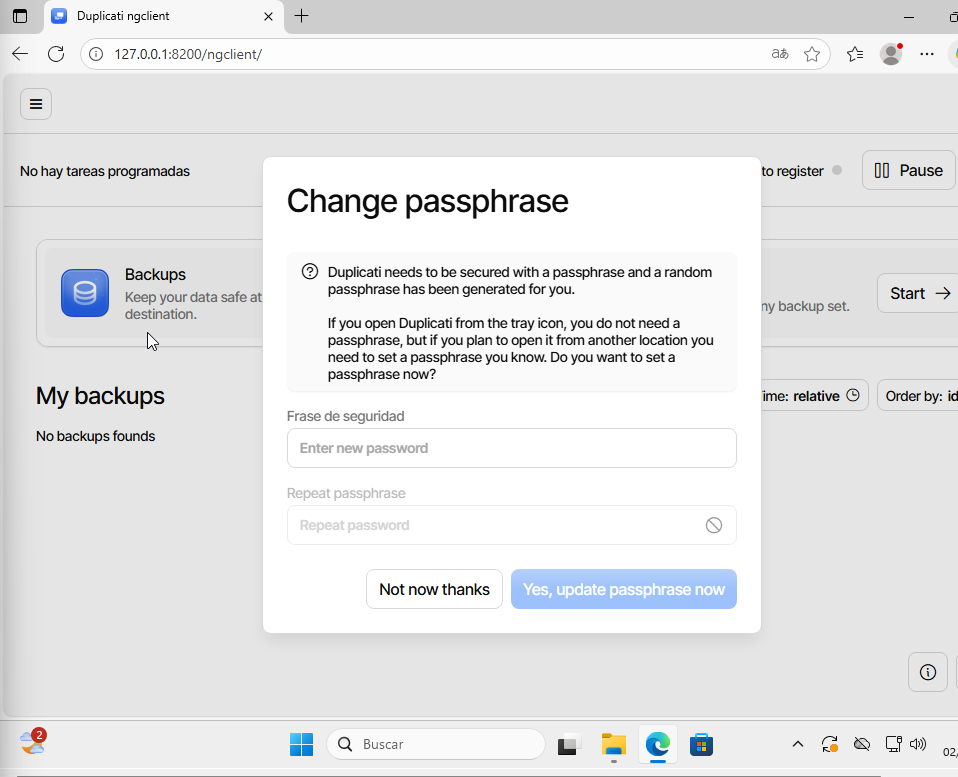


Un cop que ja tenim el duplicati, crearem alguns documents de proba per poder fer la copia de seguretat


El seguent pas sera configurar les copies de seguretat que voldrem, aixi que começarem escollint la opcio de backup add i add new backup,

Un cop aqui haurem de colocar les dades de la nostra copia 


El seguent pas sera escollir on tindrem guardada la copia, en aquest cas la guardarem en el nostre cas la guardarem en el disc secundari

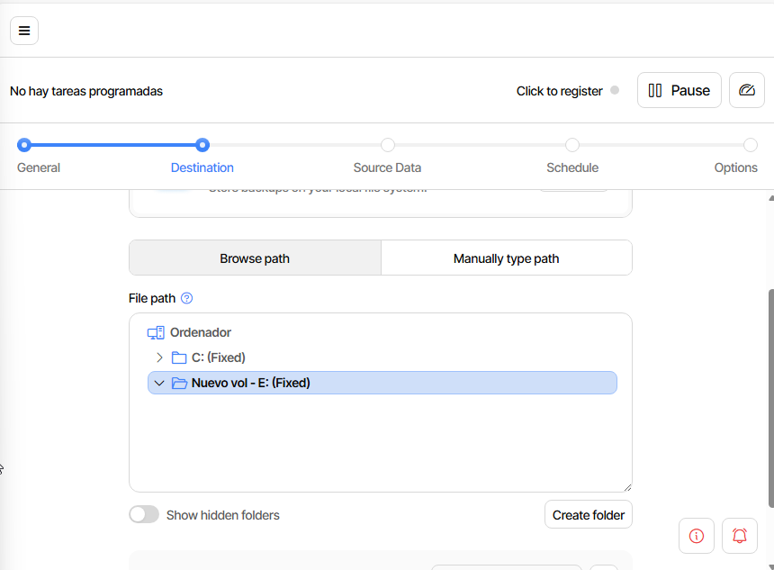

Un cop fet això hem d'escollir quins documents volem fer la copia

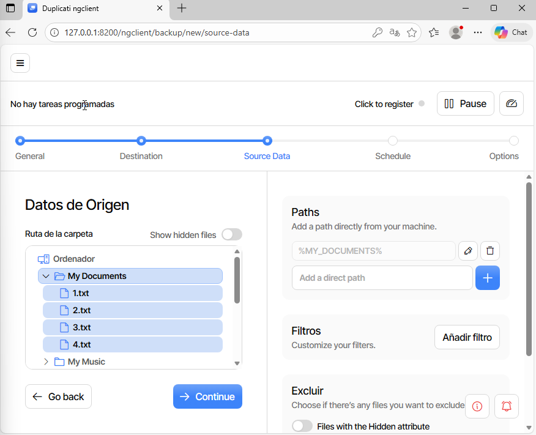

Tot seguit haurem d'escollir cada quan de temps volem que és realitzi la copia, en aquest cas la farem cada 1 hora 


Un cop que arribem aqui escollirem les opcions que en demani i un cop fet, ja tindrem la nostra copia creada


El proxim pas sera fer el mateix però amb l'unic canvi que farem la copia en el nuvol, en aquest cas farem servir el google drive, per fer-ho farem el seguent però unicament modificarem el seguent.

El lloc en el qual guardarem la copia, en la qual haurem de vincular la conta, per fer això farem click a AuthID


L'altre cosa que haurem d'editar sera cada quan és fa la copia, en aquest cas sera cada dia a las 6 de la tarda

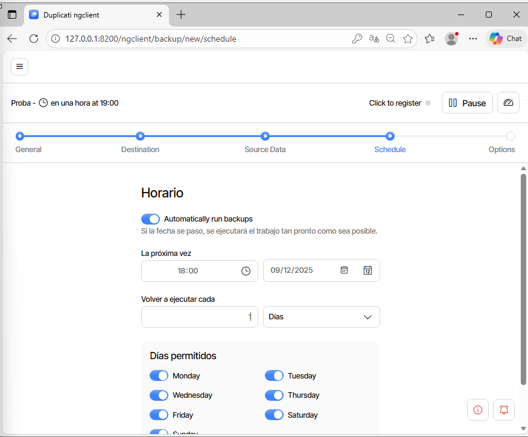

Un cop fet aixo ja tindrem les dues copies creades


El seguent pas que farem sera borrar els documents de proba per poder comprobar que podem recuperar la copia correctament 

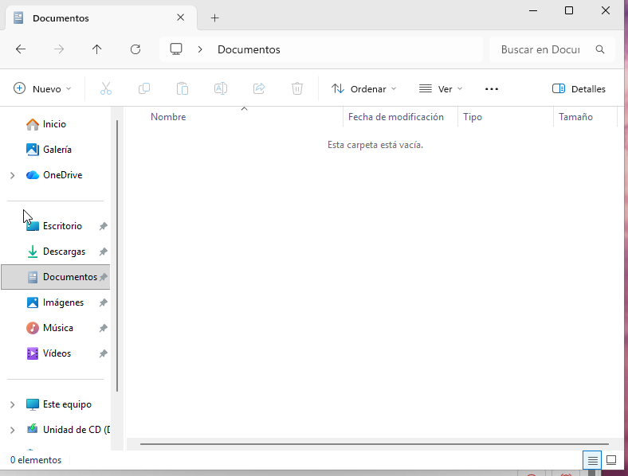

Un cop que ja hem borrat els documents, el seguent pas sera recuperar la copia, per poder fer això anirem a "Restores" i farem click a "Start"

Escollirem la copia que volem restaurar, en aquest cas proba

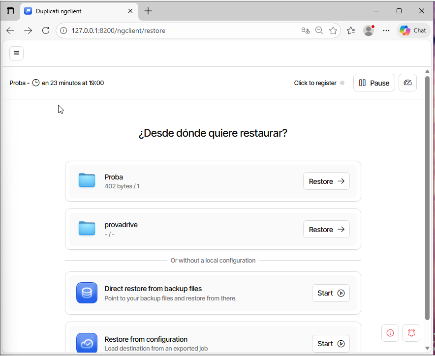

escollirem els fitxers que volem restaurar, en aquest cas la carpeta documents

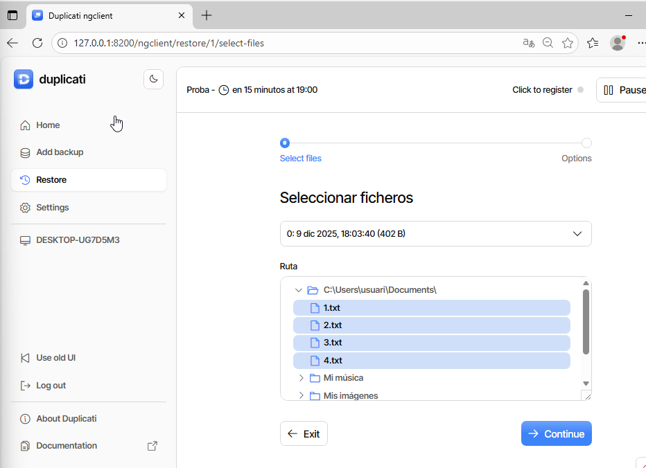

Farem siguiente siguiente i un cop fet això ja tindrem feta la restauració 

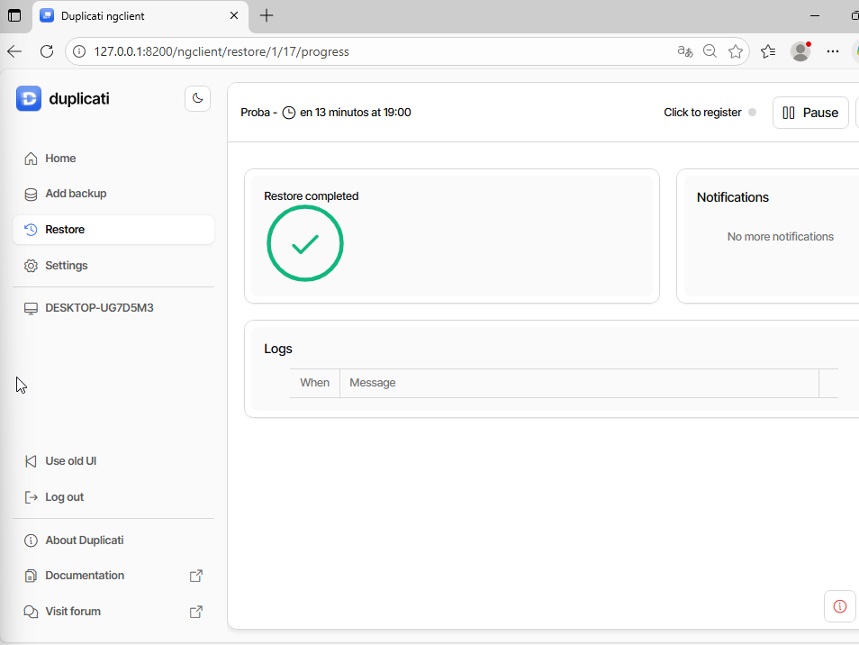

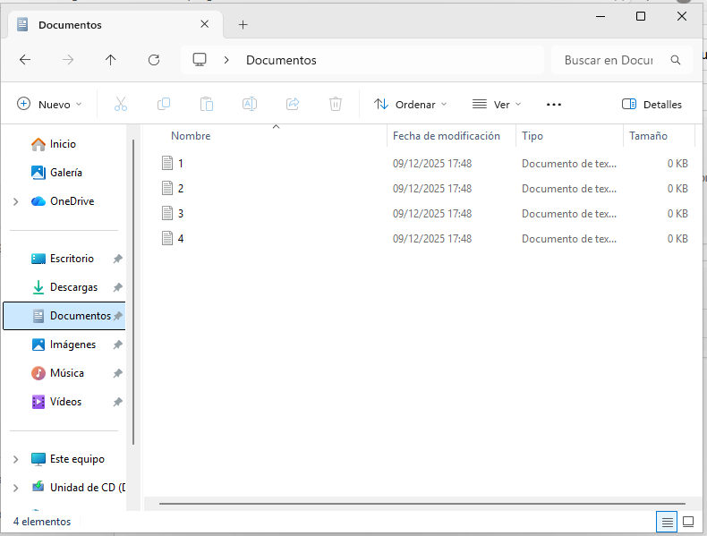

Per poder restaurar la copia que hem fet a google drive ho farem igual però selecionarem l'altre copia

---

Part 2: Còpia seguretat servidor Linux

Per poder començar haurem de tindre una maquina linux, en aquest cas farem servir una maquina ubuntu server per realitzar la prova.

El primer pas sera tindre la maquina actualitzada per tant farem 

```bash
sudo apt update && sudo apt upgrade -y 
```

Farem servir el Duplicity  per poder fer copies en local i en remot.

Per començar haurem de tindre un disc secundari, en aquest cas farem servir un disc de 10 Gb

Un cop que ja tenim el disc, el primer pas sera donar-li un format, li donarem el format xfs i muntarem al disc a la ruta /media/backup com que aquesta ruta no existeix, el primer pas sera crear la ruta, això ho farem de la seguent forma

```bash
mkdir /media/backup 
```

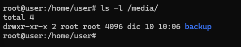

Un cop fet això haurem de donar-li format al disc, això ho farem amb l'eina fdisk, per tant el primer pas sera 

```bash
sudo apt install fdisk
```
Un cop fet això farem fdisk -l per veure el disc que tenim

```bash
fdisk -l
```

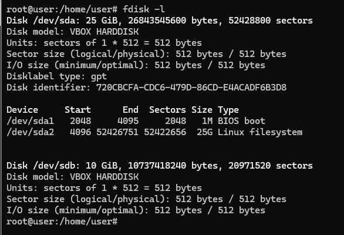

Podem veure que el segon disc esta, per tant el seguent pas sera crear el seu volum, per fer això farem servir la comanda pvcreate, per poder fer servir aquesta comanda primer haurem d'instalar lvm2 

```bash
sudo apt install lvm2
```

Un cop fet això ja podrem crear el volum en aquest cas sera amb la seguent comanda

```bash
pvcreate /dev/sdb
```


Un cop que ja tenim el volum muntat el seguent pas sera formategar-lo amb la seguent comanda

```bash
mkfs.xfs -f /dev/sdb
```

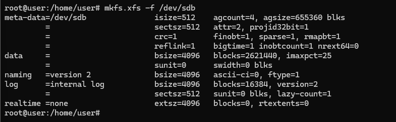

Per ultim tocara muntar el disc a la carpeta que hem crear previament, per fer axò farem la seguent comanda

```bash
mount /dev/sdb /media/backup
```


Un cop que ja tenim el disc muntat el seguent pas sera instalar Duplicity

```bash
apt install duplicity -y
```

Un cop fet això el seguent pas sera crear un parell d’usuaris amb carpeta personal i crear 4 arxius de 10 MB a la carpeta home del teu usuari.

per fer això ho farem de la seguent forma

```bash
useradd -m -s /bin/bash user1
```

```bash
useradd -m -s /bin/bash user2
```
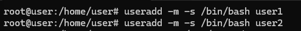
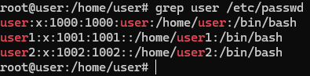

```bash
fallocate -l 10MB file1
fallocate -l 10MB file2
fallocate -l 10MB file3
fallocate -l 10MB file4
```
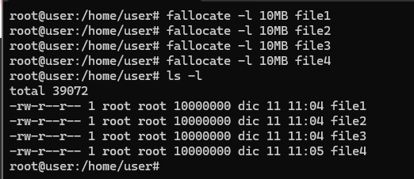


Un cop que ja tenim els arxius de prova creats els seguent pas sera fer la copia de seguretat, això ho farem amb el duplicity

La comanda per fer una copia de seguretat completa de la carpeta home sera la seguent 

```bash
duplicity full /home file:///media/backup/
```
En el moment en que ens demana el passphrase podem escollir el que nosaltres volguem, ja que és una prova en el meu cas he escollit copia


Podem veure que la copia s'ha creat correctament en el disc secundari, això amb la comanda ls

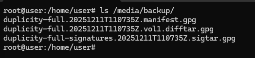

Un cop fet això el seguent pas sera esborrar els arxius i comprobar que funcionen correctament

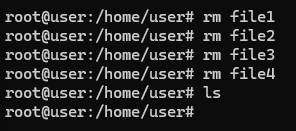

Un cop que ja no estan els arxius farem servir la copia per recuperar-los, això ho farem amb la seguent comanda:

```bash
duplicity restore --force file:///media/backup/ /home
```

Podem veure que s'han restaurat correctament

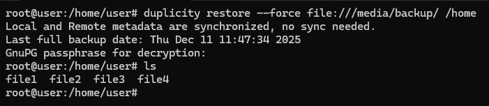

A continuació farem una copia incremental, per començar crearem un arxiu de 4mb

Per començar farem l'arxiu de prova

```bash
fallocate -l 4MB file5
```

un cop fet això tornem a fer la copia amb la seguent comanda

```bash
duplicity /home file:///media/backup/
```

Cal dir que en aquest cas no te la opcio full perque és una copia incremental

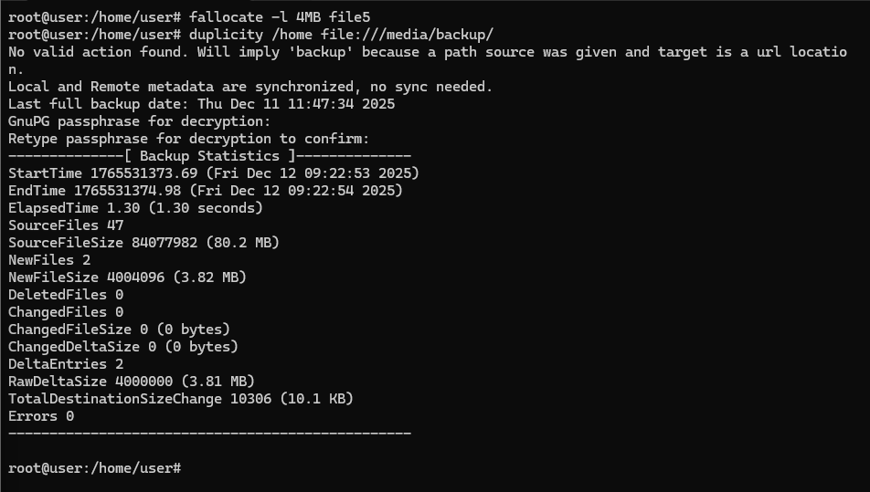

El seguent pas que farems sera fer un script perque les copies és fagin automaticament.

El primer pas que haurem de fer sera desmuntar el disc, això ho farem amb la seguent comanda 

```bash
umount /media/backup
```

El seguent pas sera crear l'script, això ho farem en un nou arxiu que anomanarem  ```fullbackup.sh```

Un cop que el tinguem creat escriurem el seguent:

```bash
!/bin/bash

export PASSPHRASE="usuariusuari1234"

mount /dev/sdb /media/backup

duplicity full /home file:///media/backup/homebackup

umount /media/backup
```

Això sera perque per si sol al principi monti el disc fagi la copia i al acabar la copia desmonti el disc, aixi asseguran que el disc unicament estara montat durant el moment de fer la copia

Un cop fet això haurem de donar permisos de execusió a l'arxiu

```bash
chmod +x fullbackup.sh
```

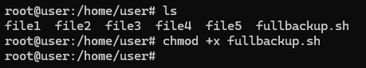

El seguent pas sera modificar l'arxiu crontab per configurar que l'script s'executi cada diumenge a les 23:00

Per arribar aquest arxiu farem la seguent comanda

```bash
crontab -e
```

Un cop dins afegirem aquesta linia 

```bash
0 23 * * 0 /home/usuari/fullbackup.sh
```

A continuació farem l'script de copia incremental, per començar crearem l'arxiu anomenat ```incrementalbackup.sh```

Un cop dins escriurem el seguent 

```bash
!/bin/bash

export PASSPHRASE="usuariusuari1234"

mount /dev/sdb /media/backup

duplicity incremental /home file:///media/backup/homebackup

umount /media/backup
```

Un cop fet això tornem a donar-li permisos 

```bash
chmod +x fullbackup.sh
```

Per ultim tornem a editar l'arxiu crontab en el qual afegirem la seguent linia

```bash
0 23 * * 1-6 /home/usuari/incrementalbackup.sh
```

Quedant algo aixì

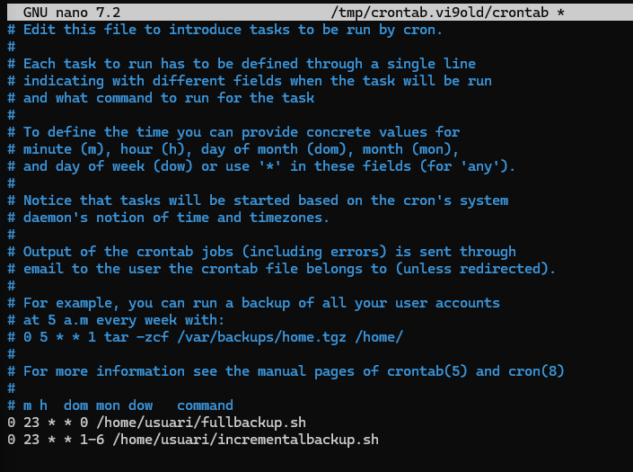
