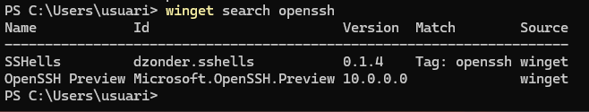
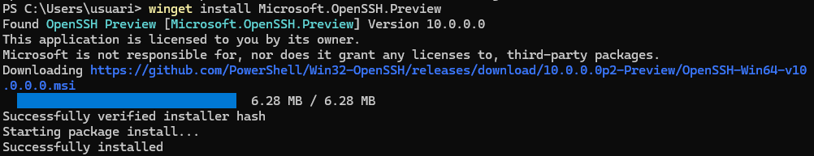
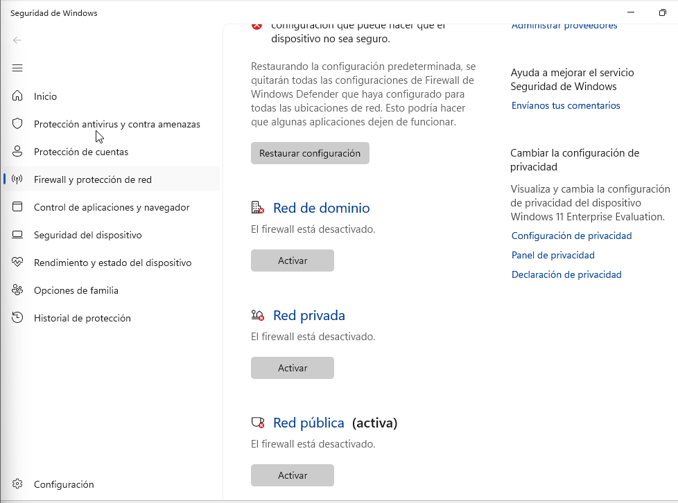
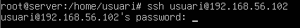
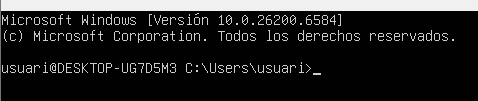
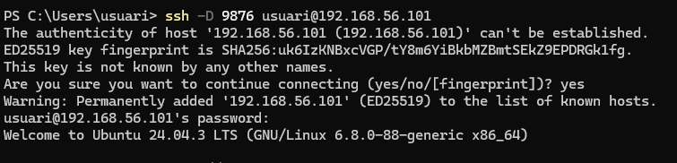
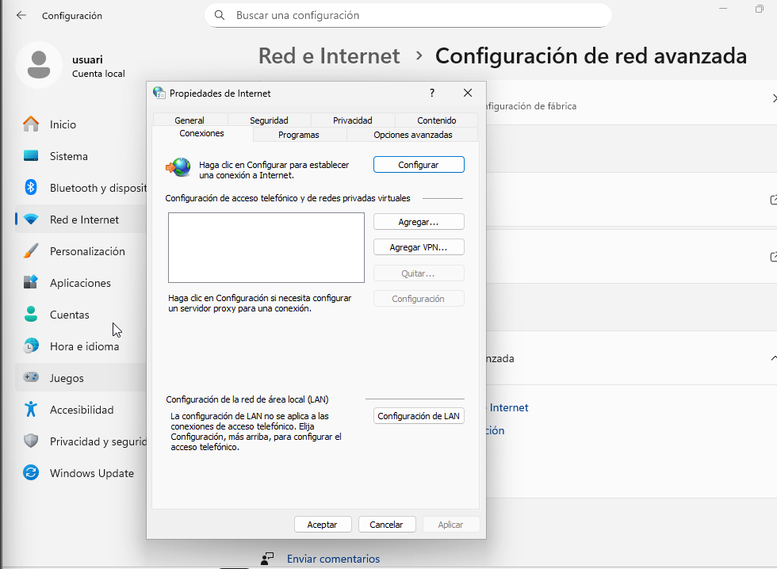
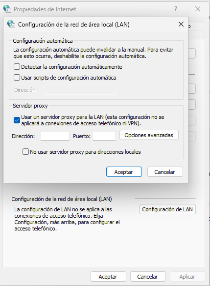
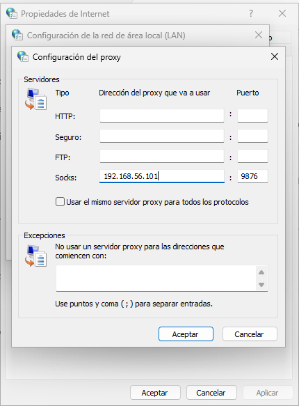
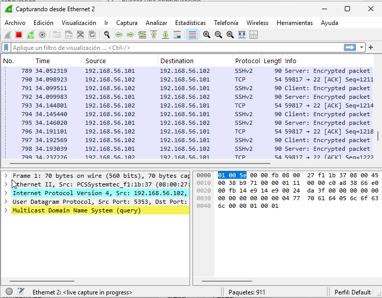

# Guia instalació SSH per linux i windows 

Per poder començar amb la instal·lació, necessitarem dues màquines: una amb Linux i una amb Windows.

Començarem amb la guia d’instal·lació d’SSH per a Linux.

---

# SSH linux

Un cop hem instal·lat la màquina Ubuntu, introduirem la següent comanda per poder actualitzar el sistema.

```bash
sudo apt update && sudo apt upgrade -y 
```

**Important**

Si no hem instal·lat l’SSH durant la instal·lació d’Ubuntu, executarem la següent comanda.

```bash
sudo apt install ssh
```

Un cop ja tenim instal·lat l’SSH, comprovarem si està activat amb la següent comanda.

```bash
systemctl status ssh
```

Si l’SSH no està activat, el podem activar amb la següent comanda.

```bash
systemctl start ssh
```

Un cop que podem veure tal i com surt a la foto podrem seguir amb el seguent pas


Un cop podem veure que tot és com mostra la imatge, podrem seguir amb el següent pas.

```bash
ip addr show
```
Un cop executem aquesta comanda, veurem el següent:


Ara, el següent pas serà fer la connexió per SSH. En aquest cas, ho farem des d’una màquina Windows, utilitzant la següent comanda:

```bash
ssh usuari@192.168.56.101
```
Ens sortirà un missatge com aquest, en el qual haurem d’escriure "yes" per poder continuar.


Un cop dins, ens demanarà la contrasenya de l’usuari.


Un cop ja estem dins de la màquina, el següent pas serà modificar l’arxiu de configuració. Per poder editar-lo, primer escriurem la següent comanda:

```bash
sudo nano /etc/ssh/sshd_config
```
Editarem l’arxiu perquè quedi de la següent manera:


Una de les configuracions que hem fet és habilitar que l’usuari root pugui fer servir SSH. Per fer-ho, primer haurem d’habilitar l’usuari root, cosa que farem de la següent manera.

Per poder fer això, necessitarem assignar una contrasenya al root. Per fer-ho, escriurem la següent comanda:

```bash
passwd root
```
Un cop fet això, ens demanarà la contrasenya.


Abans de continuar, haurem de reiniciar el servei amb la següent comanda:

```bash
systemctl restart ssh
```

Quan això ja estigui fet, podrem iniciar sessió amb l’usuari root des de SSH, fent servir la següent comanda:

```bash
ssh root@192.168.56.101
```


Ara que ja hem comprovat que podem accedir amb l’usuari root per SSH, modificarem l’arxiu de configuració per poder afegir una capa de protecció.

Per començar, tornarem a l’arxiu de configuració:

```bash
sudo nano /etc/ssh/sshd_config
```


En aquest cas, he modificat l’arxiu perquè no es pugui iniciar sessió amb l’usuari root i només es pugui iniciar sessió amb un usuari, de manera que només hi hagi un usuari autoritzat per fer servir SSH.

Per fer això, podem modificar l’arxiu tal i com es veu a la imatge:


Per poder comprovar que funciona correctament, crearem un segon usuari amb la següent comanda:

```bash
useradd -m -s /bin/bash usuari2
```
Abans de comprovar si funciona, haurem d’assignar una contrasenya a l’usuari2, cosa que farem de la següent manera:

```bash
passwd usuari2
```


Tot seguit, comprobarem si podem realitzar SSH amb l’usuari2. Per fer això, executarem la següent comanda:

```bash
ssh usuari2@192.168.56.101
```

Si intentem iniciar sessió amb l’usuari2 per SSH, podem veure que no és possible.


També hem modificat l’arxiu perquè l’usuari root no pugui iniciar sessió per SSH, però sí que pugui fer login localment. Per comprovar això, primer intentarem fer SSH amb l’usuari root amb la següent comanda:

```bash
ssh root@192.168.56.101
```

I podem veure que ens dóna un error.


En canvi, si ho fem en local amb la comanda login, podem veure que sí que podrem iniciar sessió. Això ho farem amb la següent comanda:

```bash
login root
```


Per tant, podem confirmar que l’arxiu de configuració que hem editat prèviament funciona correctament.

Mentrestant, amb l’usuari normal sí que podem fer SSH.


Ara, com a últim pas, el que farem serà accedir amb un certificat en lloc de tenir que fer servir l’usuari i la contrasenya.

Per fer això, el primer pas serà obrir el PowerShell del client i escriure la següent comanda:

```bash
ssh-keygen -t rsa
```
Un cop escrita la comanda, premem Enter fins que veiem alguna cosa semblant a la imatge:


El següent pas serà fer ls a la ruta on s’ha guardat. La ruta per defecte apareix a la sortida de la comanda anterior; en el meu cas, serà la següent:

```bash
ls C:\Users\cfgm2smxb19\.ssh
```

Podrem veure alguna cosa com això:


I, per últim, la següent comanda serà:

```bash
scp C:\Users\cfgm2smxb19\.ssh\id_rsa.pub usuari@192.168.56.101:/home/usuari
```
Podrem veure una cosa com la següent:


Un cop acabat això, anirem al servidor Ubuntu.

Per començar, haurem de crear la carpeta ssh i un arxiu dins d’aquesta carpeta anomenat authorized_keys.

És possible que aquests arxius ja estiguin creats; si ja ho estan, podem ignorar aquest pas.

Això ho farem de la següent manera:

```bash
mkdir .ssh
```

```bash
touch .ssh/authorized_keys
```
A continuació, farem servir la comanda ls amb la ruta que hem especificat prèviament; en el meu cas, és:

```bash
ls /home/usuari
```

En la qual podrem veure un arxiu anomenat id_rsa.pub

El següent pas serà veure què hi ha dins de l’arxiu, això ho farem amb la següent comanda:

```bash
cat /home/usuari/id_rsa.pub
```

Podrem veure el següent


Com a últim pas serà fer la següent comanda:

```bash
cat /home/usuari/id_rsa.pub >> .ssh/authorized_keys
```


Per acabar, comprobarem que tot funciona correctament.

Un cop fet tot això, continuarem amb Windows.

---

# SSH Windows

Un cop estem a Windows, el primer pas serà instal·lar el servidor OpenSSH.

Per fer això, ho farem amb la següent comanda:

```bash
Add-WindowsCapability -Online -Name OpenSSH.Server
```


Un cop ja tenim instal·lat, farem servir el winget per acabar d’instal·lar SSH.

Per començar, haurem de saber la ID del paquet que volem instal·lar; per poder fer això, farem servir la següent comanda:

```bash
winget search openssh
```


Un cop ja sabem la ID, únicament farem la següent comanda per poder instal·lar el paquet:

```bash
winget install Microsoft.OpenSSH.Preview
```


Un cop fet això, tocarà habilitar el servei; això ho farem amb la comanda:

```bash
Start-Service sshd
```

Si volem que el servei s’iniciï automàticament, farem servir la següent comanda:

```bash
Set-Service -Name sshd -StartupType 'Automatic'
```

Un cop ja tenim tot això fet, el següent pas serà desactivar el firewall de Windows per estalviar problemes. Per fer això, anirem a la configuració del firewall i el desactivarem.



Un cop fet això, provarem de connectar-nos per SSH des de la nostra màquina Linux a la màquina Ubuntu. Per fer això, anirem a la nostra màquina Linux i farem servir la següent comanda:

```bash
ssh usuari@192.168.56.102
```
Per saber la IP, farem ipconfig a la màquina Windows.





---

# Túnel de SSH

Per acabar, farem un túnel fent servir SSH. En aquest cas, farem servir Ubuntu com a servidor i Windows com a client; per tant, el primer pas serà executar la següent comanda:

```bash
ssh -D 9876 usuari@192.168.56.101
```



El següent pas serà editar les propietats de la xarxa.



Per començar, anirem a la configuració de LAN. Haurem d’editar tal com es veu a la imatge i continuarem anant a Opciones avanzadas.



Editarem la part final, en la qual haurem de col·locar la IP del servidor i el port que hem escollit prèviament.



Un cop fet tot això, instal·larem Wireshark per poder comprovar que tot el trànsit que generem en navegar surt via SSH cap al servidor SSH.

Podem veure que, si fem un ping a Google des de la terminal, podrem veure els paquets que van xifrats.

Per poder fer el ping, farem la següent comanda:

```bash
ping google.com
```

Un cop fem el ping, anirem a Wireshark i podrem veure que els paquets van xifrats.


