#  T06: Accés Remot — Escriptori Remot (RDP) (tasca individual)

## Configuració de la màquina Windows


Per començar a realitzar aquesta activitat necessitarem 2 maquinàs virtuals, la primera serà una màquina Windows i la segona una màquina zorin

Un cop que ja tinguem les màquines el primer pas sera afegir un segon adaptador, en aquest cas farem servir host-only en les dues màquines.

Un cop fet això començarem per la màquina Windows, el següent pas sera buscar l'opció de ```Configuración de Escritorio Remoto```

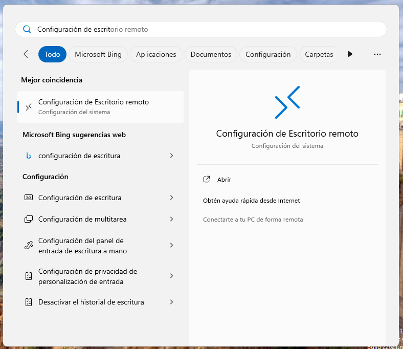

Un cop dins haurem d'activar la opció de ```Escritorio Remoto```

Això ho farem per poder connectar-nos remotament des de la màquina Windows

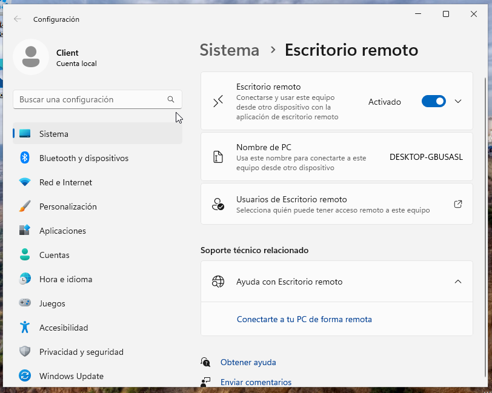

---

## Configuració de la màquina Zorin

Un cop fet això continuarem configurant la màquina zorin

A continuació anirem a configuració per poder activar l'escriptori remot, per fer això primer haurem d'anar a l'apartat de sistema dins de configuració.

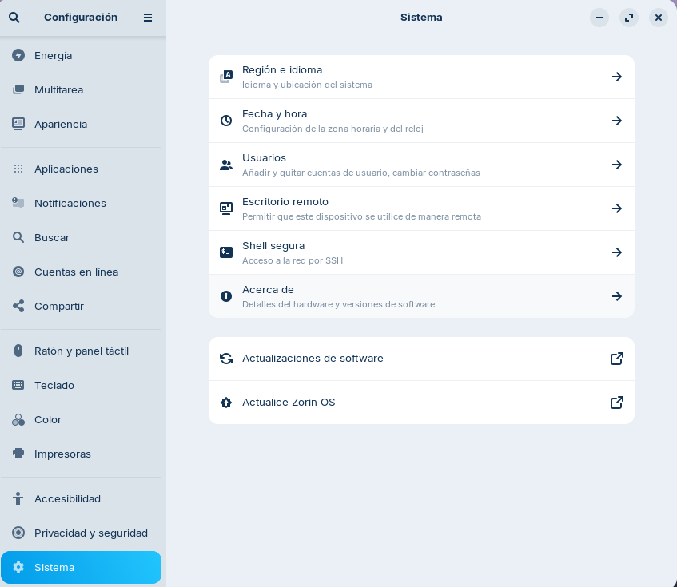

Un cop dins configurarem l'escriptori remot, per fer això primer haurem d'activar les 2 primeres opcions, i al final de tot ens demanar l'usuari i contrasenya, podem col·locar qualsevol que nosaltres preferim, en aquest cas col·locaré la mateixa que l'usuari.

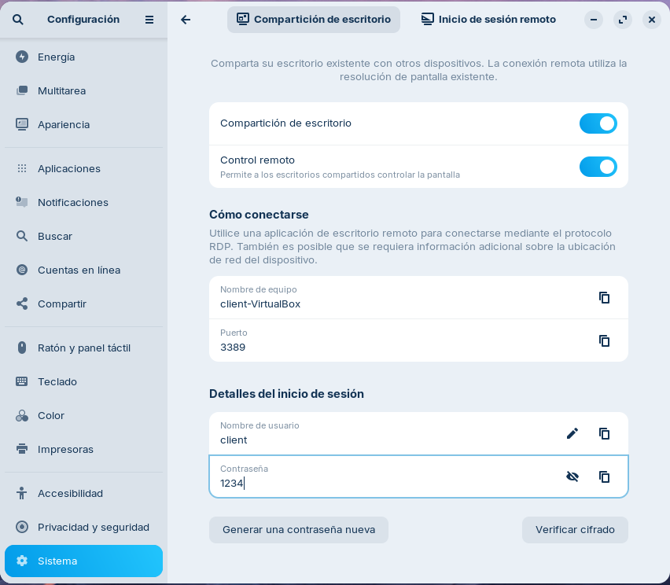

Un cop que ja tenim les 2 màquines configurades, el següent pas sera connectar-se.

---

## Connexió des de la màquina Windows a la màquina Zorin

Per connectar-nos a la màquina zorin des de la màquina Windows farem servir l'eina Conexión a Escritorio Remoto que ve per defecte a Windows.

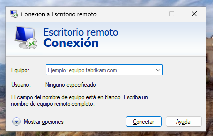

Un cop amb l'eina oberta haurem d'introduir la IP de la màquina zorin, per saber la IP farem un ```ip a``` a la terminal de la màquina zorin.


Un cop dins ens demana les credencials 

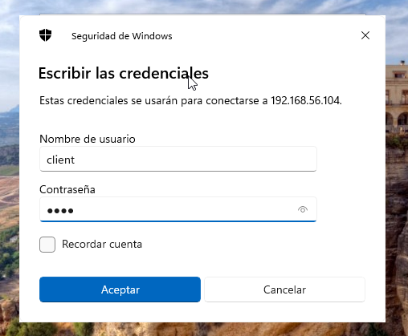

A continuació sortirà una finestra d'advertència de certificat en la qual acceptarem per poder continuar

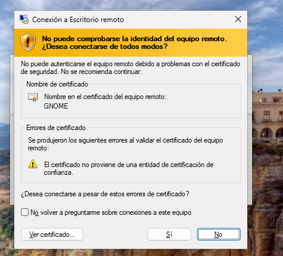

Un cop fet tot això podrem veure que ja estem dins de la màquina zorin

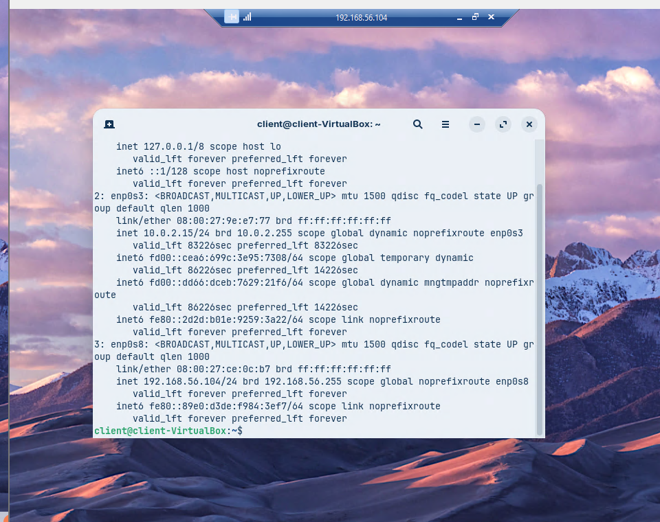

---

## Connexió des de la màquina Zorin a la màquina Windows

A continuació ens connectarem des de la màquina Windows a la màquina zorin, en aquest cas farem servir l'eina Remmina que ja ve instal·lada per defecte en zorin

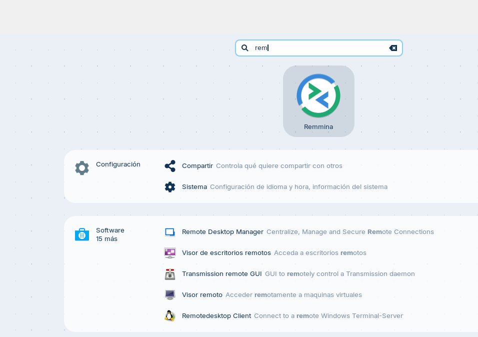

Un cop que ja estem dins de remina haurem d'introduir la ip de la nostra màquina windows, per saber la nostra ip en Windows anirem a PowerShell i escriurem ipconfig

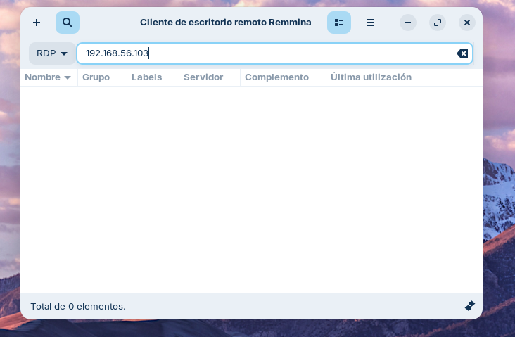

Tot seguit apareix una finestra d'advertència de certificat en la qual direm que sí per poder continuar

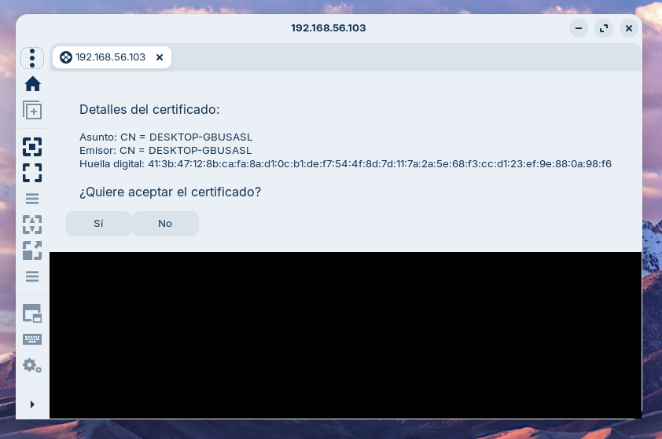

Un cop fet això ens demana les credencials de l'usuari

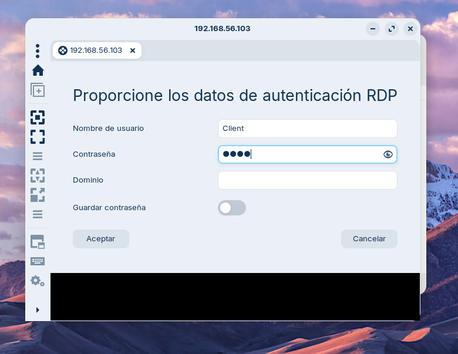

Un cop fet això podrem veure que ja estem dins de la màquina Windows

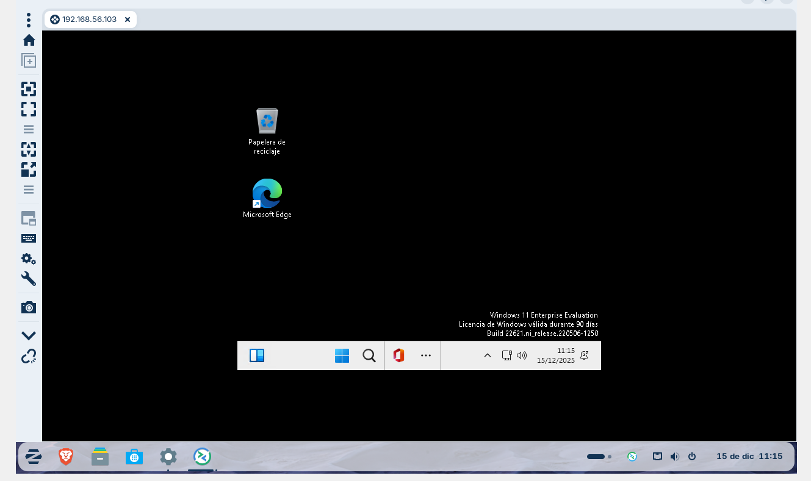
