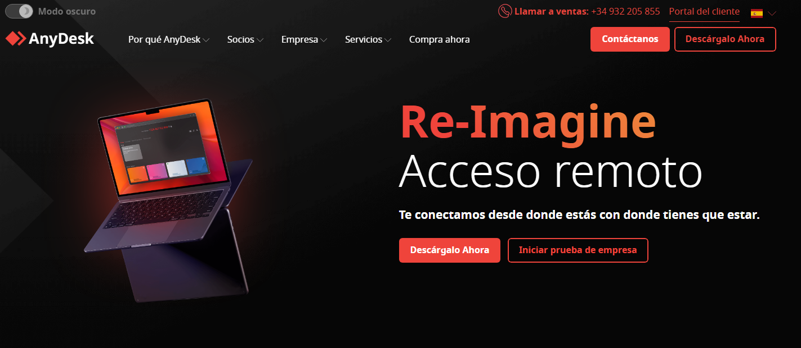
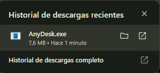
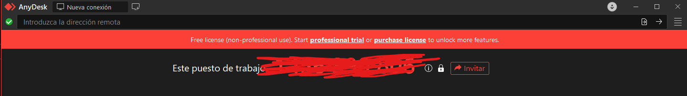
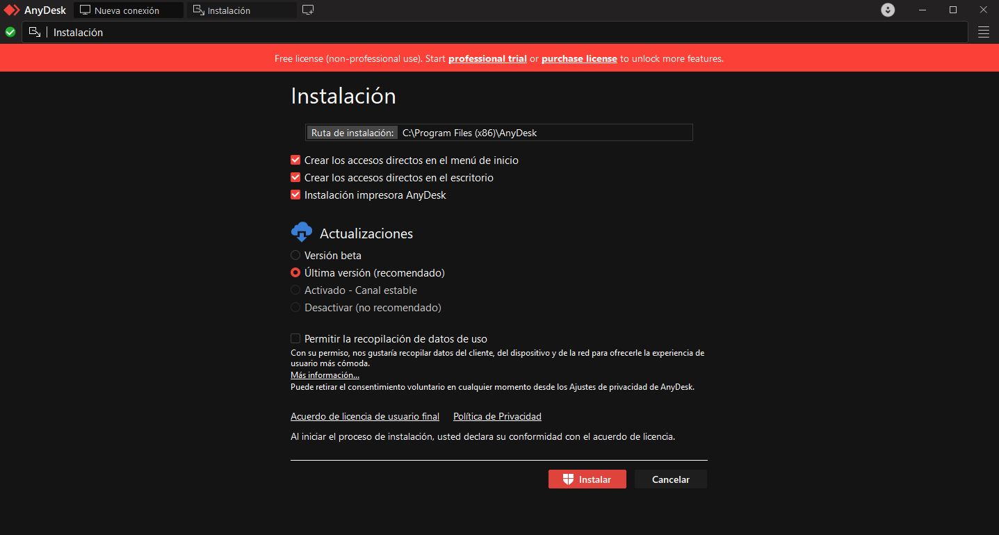
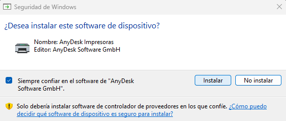
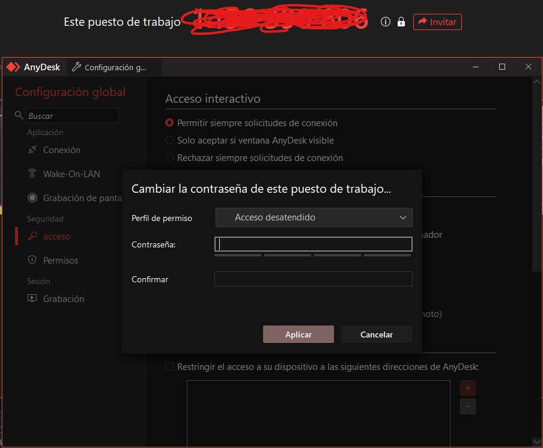
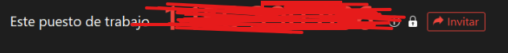
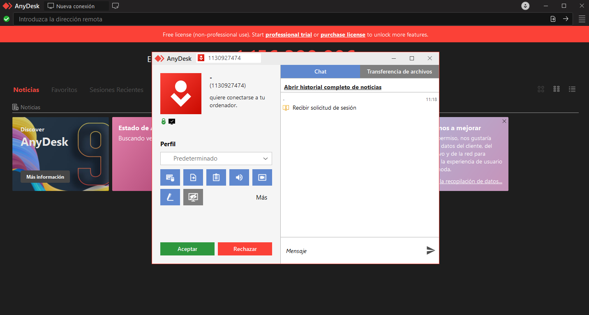
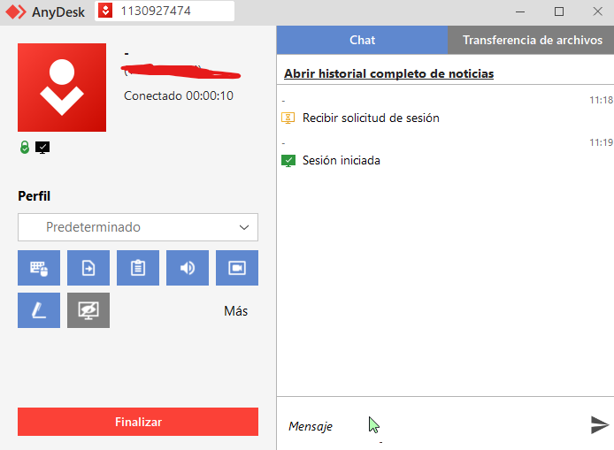

# Manual per al Client

A aquesta guia explicarem com instal·Lar-nos AnyDesk, amb els seguents apartats:

1.  L'enllaç o la manera de descarregar el mòdul "Quick Support" (o equivalent) que no requereixi instal·lació.
2.  On han de fer el click exactament
3.  Com identificar i comunicar al tècnic l'ID de sessió i la contrasenya (si n'hi ha).
4.  Com acceptar la petició de connexió.

## Pas 1: Descargar AnyDesk

Per poder descarregar AnyDesk, buscarem "AnyDesk" al buscador, o bé entrarem al seguent enllaç i farem click al botó vermell on diu "Descàrrega ara" per descarregar l'eina de Quick Support. [AnyDesk](https://anydesk.com/es)

Tot seguit, farem click a la finestra de descàrregues que es mostra a la part superior dreta, què és l'instal·lador d'AnyDesk per poder instal·lar l'assistent remot.

Quan estiguem a dins d'AnyDesk, pressionarem el quadrat rosa que possa "Instalar AnyDesk" 

Quan haguem fet això, introduïm el lloc on volem fer la instal·lació i seleccionarem la última versió. Després, pressionem el boto "Instalar".

Ens apareixerà una pantalla emergent si volem instal·lar un controlador d'AnyDesk, i pressionarem instal·lar.

---

## Pas 2: Iniciar sessió de suport

Al costat del número de connexió, ens apareixerà un candau. Si el pressionem podrem canviar la contrasenya de connexió, per evitar que entrin connexions no desitjades.

Al menú principal ens apareixerà un còdi de connexió escrit en vermell (en el meu cas el censuro), aquest número li haurem de passar al tècnic.

Li donarem el còdi de connexió al tècnic. Ho podem fer per trucada o missatge. Un cop el tècnic hagi possat el còdi, ens apareixerà una finestra on haurem d'introduïr la nostra contrasenya que hem establert abans d'AnyDesk (en tot cas que tinguem), i acceptar la connexió. Deixarem que el tècnic faci la resolució adient al nostre problema. Cal destacar que disposem d'un xat per qualsevol dubte o consulta que tinguem cap al tècnic i una sèrie d'eines per configurar la connexió.

Al haver acabat la connexió, pulsarem el botó vermell que diu "Finalitzar" per tancar la connexió, i fet això, ja podriem tancar l'AnyDesk.

