# Projecte04: Servidor NFS

## El Cas Client:  DevOptimize Solutions

El nostre client, `DevOptimize Solutions`, és una petita startup de desenvolupament de programari que treballa exclusivament amb Linux. Tenen un problema crític: el seu codi font i els seus actius (documents de disseny, scripts) estan descontrolats. Cada desenvolupador té còpies locals, cosa que provoca errors de versió constants i una pèrdua d'eficiència brutal.
Ens han contractat per implementar un servidor de fitxers centralitzat. Atès que tot l'entorn és Linux, la solució nativa, més ràpida i eficient del sector és NFS (Network File System).
El client ha insistit en que treballa sense un entorn d’autenticació centralitzada i que, de moment, no té previst fer aquest pas.

Per mostrar al client com quedarà la solució proposada a partir de les seves demandes i poder mostrar també les seves limitacions, se t’encarrega fer una demostració del sistema.

Crearàs un servidor NFS (NFSv3) i un client Linux que consumeixi els recursos compartits. Hauràs de crear usuaris i grups per simular l'entorn del client i demostrar el control d'accés utilitzant les opcions d'exportació (/etc/exports) i els permisos del sistema de fitxers (chmod, chown).


---

# Fase 1: Preparació de l'entorn

Per començar en aquesta guia hem de tindre 2 màquines, en aquest cas tindrem un Ubuntu server i un zorin per simular el client.

Les dues màquines han de tindre 2 interfícies, la primera NAT i la segona host only.

Un cop que ja tenim les dues màquines instal·lades començarem configurant el servidor.

La primera comanda que farem serà per actualitzar els paquets.

```bash
sudo apt update && sudo apt upgrade -y 
```

Un cop que ja tenim actualitzat els paquets, el següent pas sera començar amb la creació de l'estructura de carpetes, de grups i usuaris.

Abans de continuar hem de confirmar que les màquines es poden veure entre si, això ho farem amb un ping.

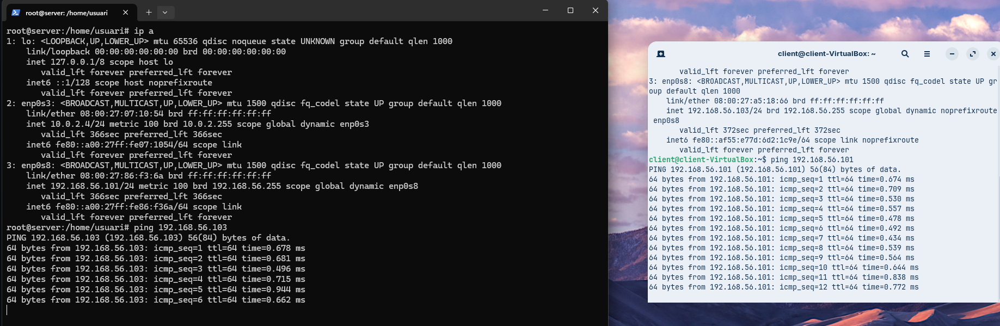

---

# Fase 2: Preparació del servidor

El primer que farem serà crear els grups necessaris, en aquest cas en demana que crem 2 grups, el primer devs i el segon admin

Per crear aquests grups farem la següent comanda 

```bash
groupadd devs
```

```bash
groupadd admin
```

Per comprovar que l'arxiu s'ha creat correctament farem servir el greep per buscar tant el grup devs com admin dins de l'arxiu /etc/groups, per fer-ho farem la següent comanda.

```bash
grep devs /etc/group
```

```bash
grep admin /etc/group
```

En la qual podrem veure que els grups s'han creat correctament

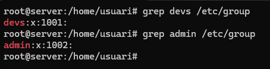

Un cop que ja tenim els grups creats el següent pas sera crear l'usuari dev01 que formi part del grup devs, per fer això farem servir la següent comanda.

```bash
useradd -G devs -m -s /bin/bash dev01
```

Tot seguit farem el mateix per l'usuari admin01, en la qual farem la següent comanda

```bash
useradd -G admin -m -s /bin/bash admin01
```

Per confirmar que estan creats correctament tornarem a fer servir el grep.

```bash
grep dev01 /etc/passwd
```

```bash
grep admin01 /etc/passwd
```

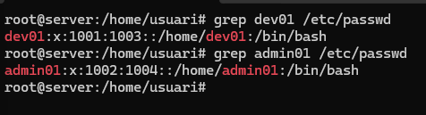

Un cop que ja hem creat els grups i els usuaris, el següent pas sera crear el directori per als projectes de desenvolupament en la qual la ruta que ens demana és la següent /srv/nfs/dev_projects, per crear totes les carpetes d'una sola comanda farem el següent:

```bash
mkdir /srv/nfs/dev_projects -p
```

Un cop fet això crearem el directori per a les eines d'administració en la qual la ruta serà /srv/nfs/admin_tools

```bash
mkdir /srv/nfs/admin_tools
```

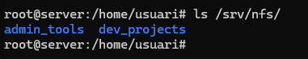

Per últim, configurarem els permisos de les carpetes, en aquest cas seran els següents.

Chown per canviar la propietat de la carpeta

```bash
chown root:devs /srv/nfs/dev_projects
```

```bash
chown root:admin /srv/nfs/admin_tools
```

Un cop fet això assignaré els permisos de la carpeta amb la comanda chmod

```bash
chmod 2775 /srv/nfs/dev_projects
```

```bash
chmod 2775 /srv/nfs/admin_tools
```

Per comprovar que els permisos estan correctes farem ls -l per poder veure els permisos de cada carpeta

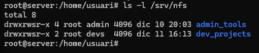

Avans de continuar amb el servidor crearem els grups i usuaris dins de la maquina client, en aquest cas una maquina zorin.

Per poder crear els grups i usuaris farem servir la aplicació "users and groups"

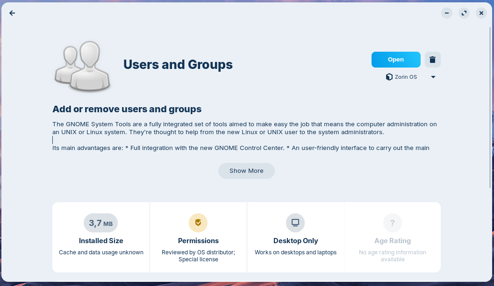

Per comprovar que tots els grups s'han creat correctament farem servir el grep tal com hem fet abans

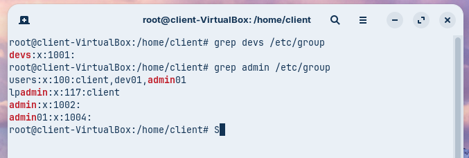

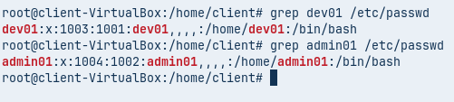

Hem de comprovar que els números UID i GID (els números d'identificació) coincideixin a les dues màquines.

Un cop fet això instal·larem els paquets necessaris del servei NFS al servidor, per fer això farem la següent comanda.


```bash
apt install nfs-kernel-server -y
```
Per comprovar que s'ha instal·latat correctament podem fer un systemctl status

```bash
systemctl status nfs-kernel-server
```

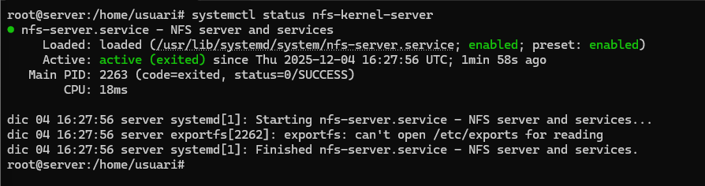

Per començar, editarem l'arxiu /etc/exports per poder decidir quins arxius volem exportar, en aquest cas volem exportar tota la carpeta /srv/nfs

Afegirem una línia addicional al final de l'arxiu, en aquest cas serà la següent 

```bash
/srv/nfs *(rw,sync,no_subtree_check)
```

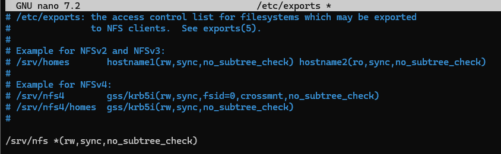

Per poder aplicar els canvis haurem de reiniciar el servei amb la comanda

```bash
systemctl restart nfs-kernel-server
```
Un cop fet això l'iniciem i comprovarem que tot funciona correctament 

En el servidor podem fer la comanda 

```bash
exportfs -u
```
Amb la qual podrem veure quins arxius es poden exportar

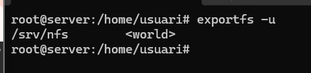

També podem fer la següent comanda per veure des-de quin port treballa, en aquest cas ho fa amb el port 2049.

```bash
rpcinfo -p 192.168.56.101
```
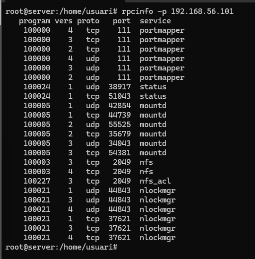

Per poder comprovar en la màquina haurem d'instal·lar el paquet nfs-common, això ho farem amb la següent comanda.

```bash
sudo apt install nfs-common -y
```

Un cop fet això en connectarem al servidor amb la comanda showmount -e IP

En el meu cas serà la següent comanda 


```bash
showmount -e 192.168.56.101
```

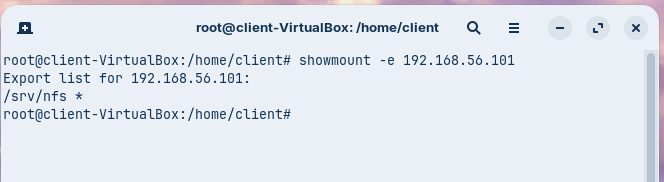

En la qual podem veure que la carpeta /srv/nfs

---

# Fase 3: L'Exportació d'Administració (El Dilema del root_squash)

A continuació farem una prova 1 (L'error comú)

Prèviament, ja hem exportat l'arxiu /srv/nfs, per tant, el següent pas que hem de fer serà muntar aquest recurs a la carpeta /mnt/admin_tools, en un principi aquesta carpeta no existeix, per tant, el primer pas sera crear-la, això ho farem amb la següent comanda.

```bash
mkdir /mnt/admin_tools 
```

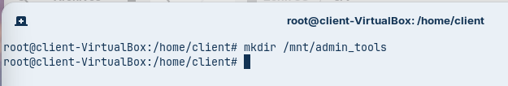

Un cop que tenim creada la carpeta, el següent pas sera muntar el recurs, això ho farem amb la comanda mount 

```bash
mount -t nfs 192.168.56.101:/srv/nfs/admin_tools /mnt/admin_tools
```

Podrem veure no podem crear cap arxiu, ja que no tenim els permisos, ja que el root de la màquina client i el root del servidor no és el mateix.

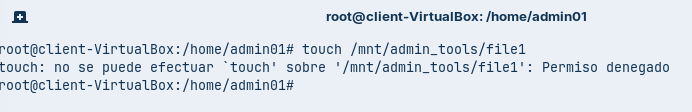

Mentre que si intentem crear un arxiu amb l'usuari admin sí que podrem, ja que aquest usuari sí que té permisos en aquesta carpeta.

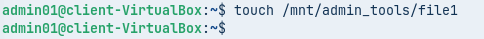

Podem veure que l'arxiu que hem creat és propietat de admin01

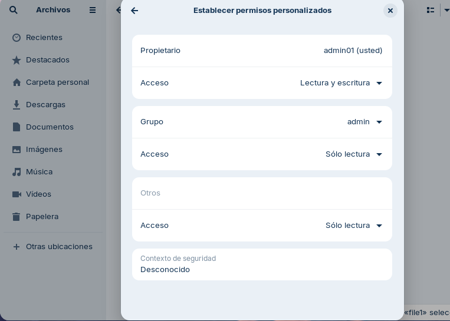

A continuació ensenyaré com fer per poder crear arxius amb root

Prova 2 (La Solució)

Per començar, haurem d'editar l'arxiu /etc/exports en el qual substituirem la línia que hem escrit prèviament per les següents.

```bash
/srv/nfs/admin_tools *(rw,sync,no_subtree_check,no_root_squash)
/srv/nfs/dev_projects *(rw,sync,no_subtree_check)
```

Un cop fet això reiniciem el servei un altre cop amb la comanda 

```bash
systemctl restart nfs-kernel-server
```

A continuació haurem de desmuntar i muntar un altre cop el recurs, en el meu cas la comanda per desmuntar serà 

```bash
umount -t nfs 192.168.56.101:/srv/nfs/admin_tools /mnt/admin_tools
```
I per muntar

```bash
mount -t nfs 192.168.56.101:/srv/nfs/admin_tools /mnt/admin_tools
```

Un cop fet això podrem crear un nou arxiu, per exemple en aquest cas he creat un arxiu anomenat file2

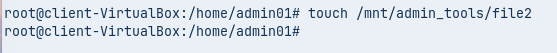

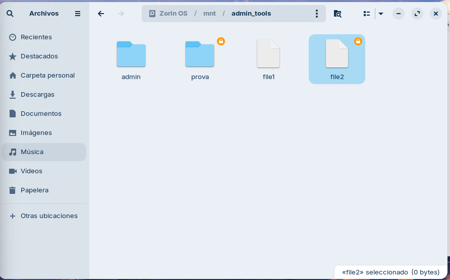

Això a causa que hem modificat l'arxiu /etc/exports fent que el root de la màquina física sigui el mateix que el root del servidor, per tant, tenim total llibertat. 

---

# Fase 4: L'Exportació de Desenvolupament (Permisos rw vs ro)

A continuació el client ens demana el següent la xarxa d'administració (p.ex., 192.168.56.0/24) hi pugui escriure, però que la xarxa de consultors (p.ex., 192.168.56.100) només pugui llegir.

Per poder fer això haurem de modificar l'arxiu /etc/exports i substituir la línia "/srv/nfs/dev_projects *(rw,sync,no_subtree_check)" per les següents. 

```bash
/srv/nfs/dev_projects 192.168.56.0/24(rw,sync,no_subtree_check)
/srv/nfs/dev_projects 192.168.56.140(ro,sync,no_subtree_check)
```
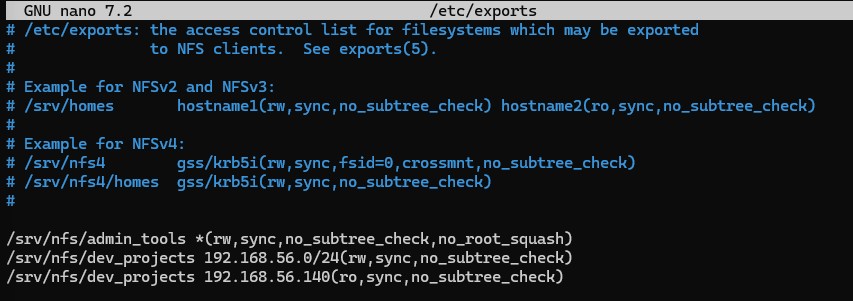

Això ho fem per poder assignar permisos depenen de la ip que tingui l'usuari

Tot seguit fem un reinici el servei amb la comanda 

```bash
systemctl restart nfs-kernel-server
```

Un cop fet això haurem de muntar el disc dev_projects per comprovar que tot funciona correctament.

El primer pas sera crear la carpeta amb la següent comanda

```bash
mkdir /mnt/dev_projects
```

El següent pas que farem serà modificar el nostre ip, en aquest cas provarem amb la ip ```192.168.56.128``` per poder fer això anirem a la configuració de xarxa i col·locarem la ip manualment i muntarem el disc.

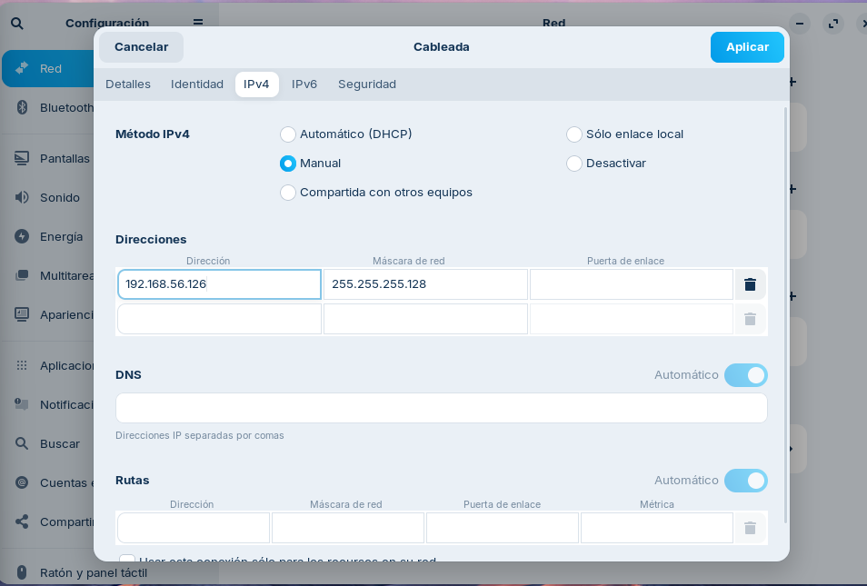

Un cop fet això si fem login l'usuari dev01 com que tenim una ip dins del rang que pot editar dins de la carpeta sí que podrem crear arxius

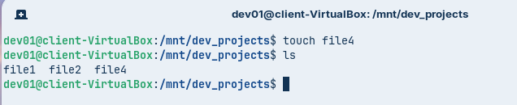

Mentre que canviem la ip ```192.168.56.140``` podrem observar que no podem editar els arxius, però sí que podem veure que hi ha a la carpeta, haurem de tornar a desmuntar i muntar el disc.

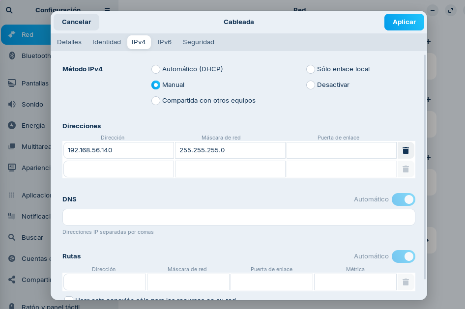

Podrem veure que podem accedir a la carpeta i veure que hi ha dins, però no podrem modificar el contingut, ja que només tenim permisos de lectura.

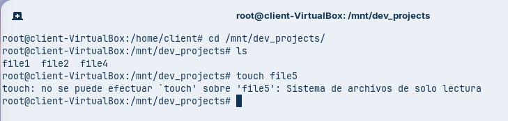

Ara per últim farem login amb l'usuari admin01 i intentarem crear un arxiu en la carpeta dev_projects

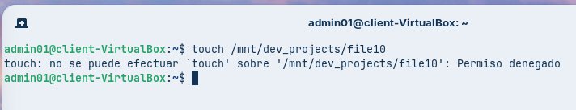

Podem veure que no podem crear cap arxiu dins de la carpeta dev_projects, ja que no tenim els permisos necessaris, ja que l'usuari admin01 no forma part del grup dev01

---

# Fase 5: Muntatge Automàtic amb /etc/fstab


Ara per últim modificarem l'arxiu /etc/fstab per poder configurar que els recursos compartits no es hagin de muntar cada vegada que entrem.

Per començar, farem la següent comanda per entrar a l'arxiu

```bash
sudo nano /etc/fstab
```

En el qual haurem d'afegir aquestes dues lines al final

```bash
192.168.56.101:/srv/nfs/admin_tools /mnt/admin_tools nfs defaults 0 0
192.168.56.101:/srv/nfs/dev_projects /mnt/dev_projects nfs defaults 0 0
```
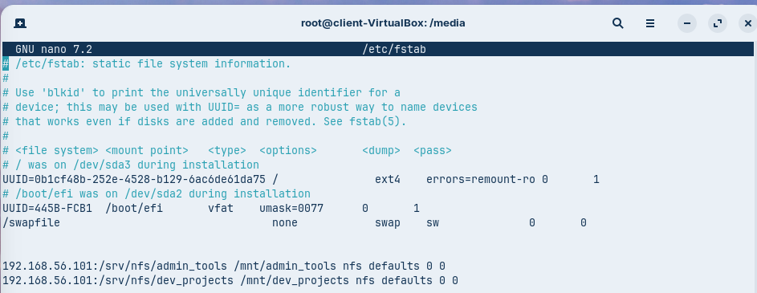

Un cop fet això reiniciem la màquina i confirmem que discos s'han muntat correctament 

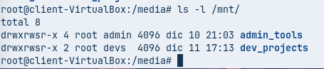

---

# Conclusió

Per poder millorar aquest producte podríem millorar el següent, per exemple un dels problemes és que s'han de crear els usuaris i grups al servidor i a la màquina client, això no és òptim, ja que en un entorn real en el qual podrien haver més de 20 ordinadors de part del client. Basicament seria repetir el mateix pas 21 vegades (20 pels clients i 1 pel servidor)

Una solució real per aquest problema seria centralitzar les dades dels usuaris i grups en únic lloc com per exemple LDAP així per evitar feina innecessària.
